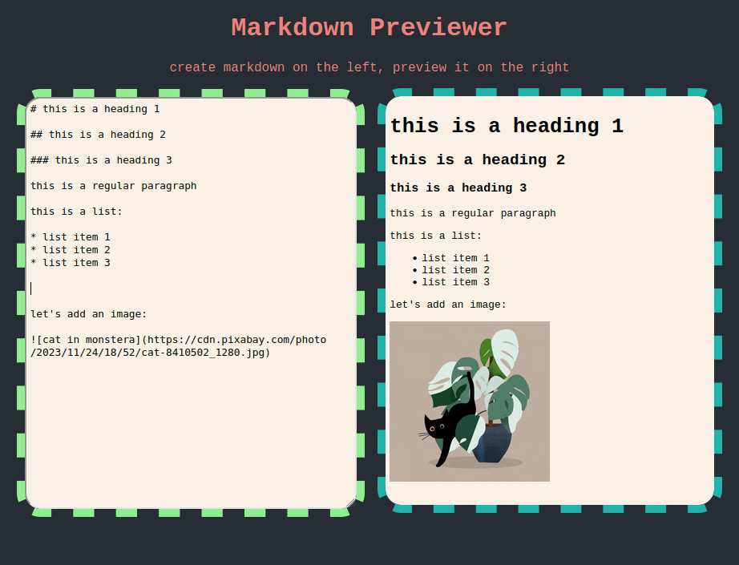

# Markdown Previewer

## Description

This Markdown Previewer is a simple, yet powerful tool for writing and previewing markdown in real-time. Built with React and the marked.js library, it allows users to input markdown text and instantly view the rendered HTML output.



## Features

- **Live Markdown Editing**: Write markdown in a text area and see the HTML preview as you type.
- **Responsive Design**: coming soon, not yet optimized for mobile.

## Installation

To set up the Markdown Previewer on your local machine, follow these steps:

1. Clone the repository:
```
git clone https://github.com/the-imp0ster/react-markdown-previewer
```

2. Install dependencies:
```
npm install
```

3. Run the application locally:
```
npm start
```


## Using the App

To use the Markdown Previewer, simply:

1. Enter your Markdown text into the left-hand text area.
2. The right-hand side will automatically display the rendered HTML output of your Markdown.


## Links to Related Documentation

- [React](https://reactjs.org/)
- [marked.js](https://github.com/markedjs/marked)

